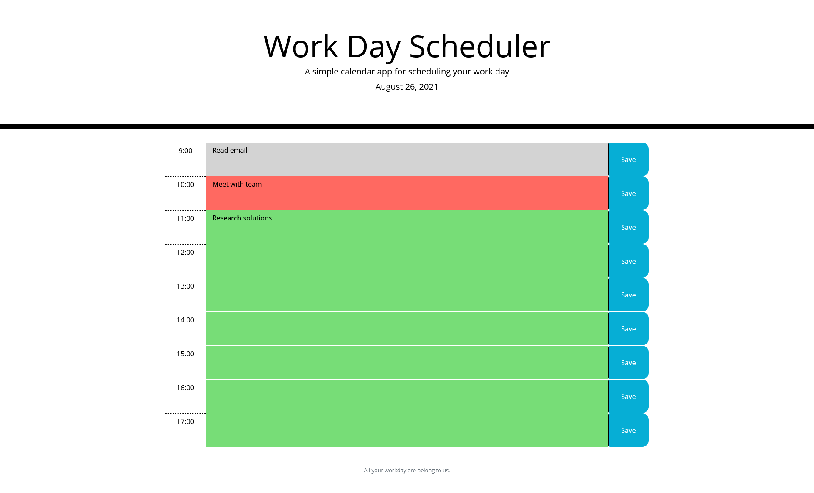

# workday_scheduler
A simple app for creating a schedule for a workday by Brian Baker

This app is implemented with jQuery, Bootstrap, and Moment.js.

To use the app, simply load the webpage, which is [live here](https://baker-ling.github.io/workday_scheduler/).

The app will show the hours of the workday, color coded by whether the hour has passed, is ongoing, or is in the future (in reference to the time when the app was loaded).

To add plans to your schedule, type your plans in the column in the middle, then click the save button on the same row. You can then reload the page without losing your schedule. You can even come back the next day, and your schedule will still be there!
